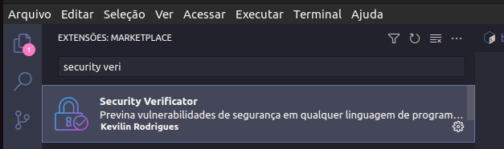
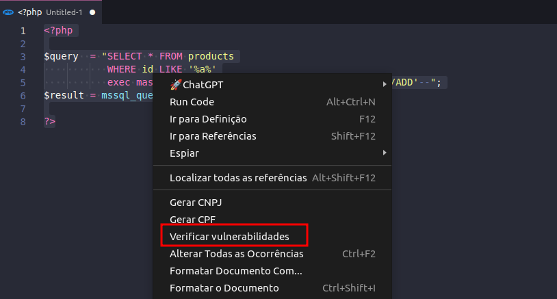
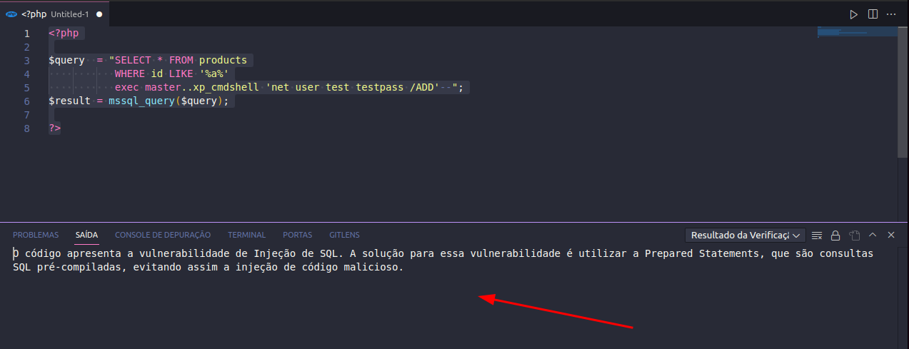

# Security Verificator

Instale a extensão no Marketplace do VS Code:

Em qualquer tipo de arquivo aberto em seu VS Code, selecione o trecho que código que quer analisar as vulnerabilidades e clique com o botão direito. Após, selecione a opção "Verificar Vulnerabilidades".

Aguarde o console abrir automaticamente com a resposta:

